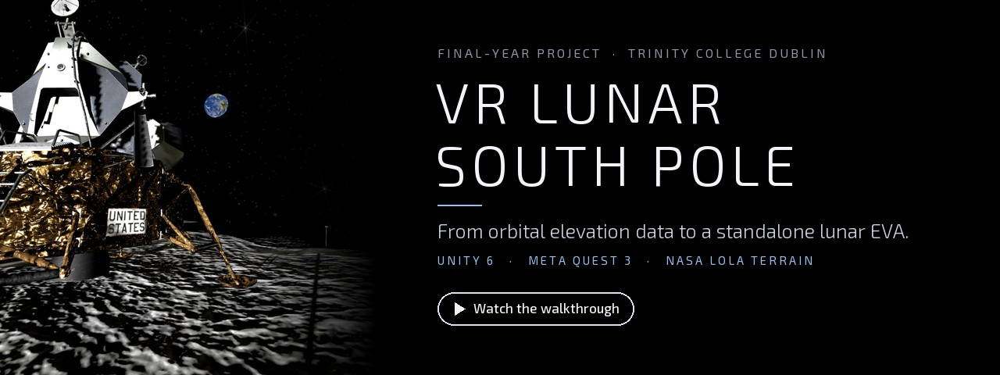
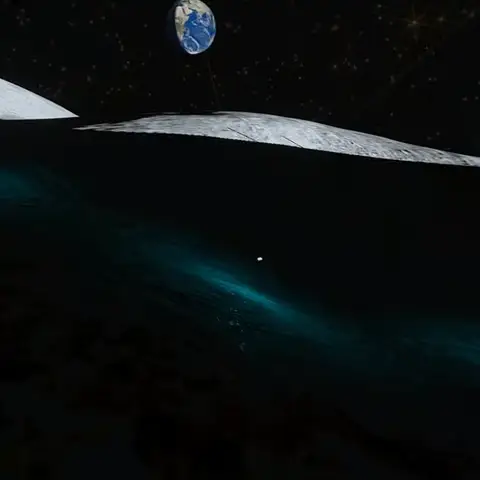
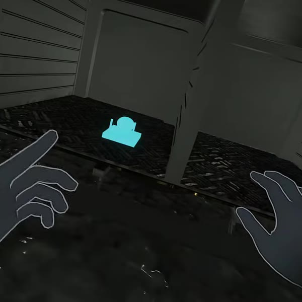
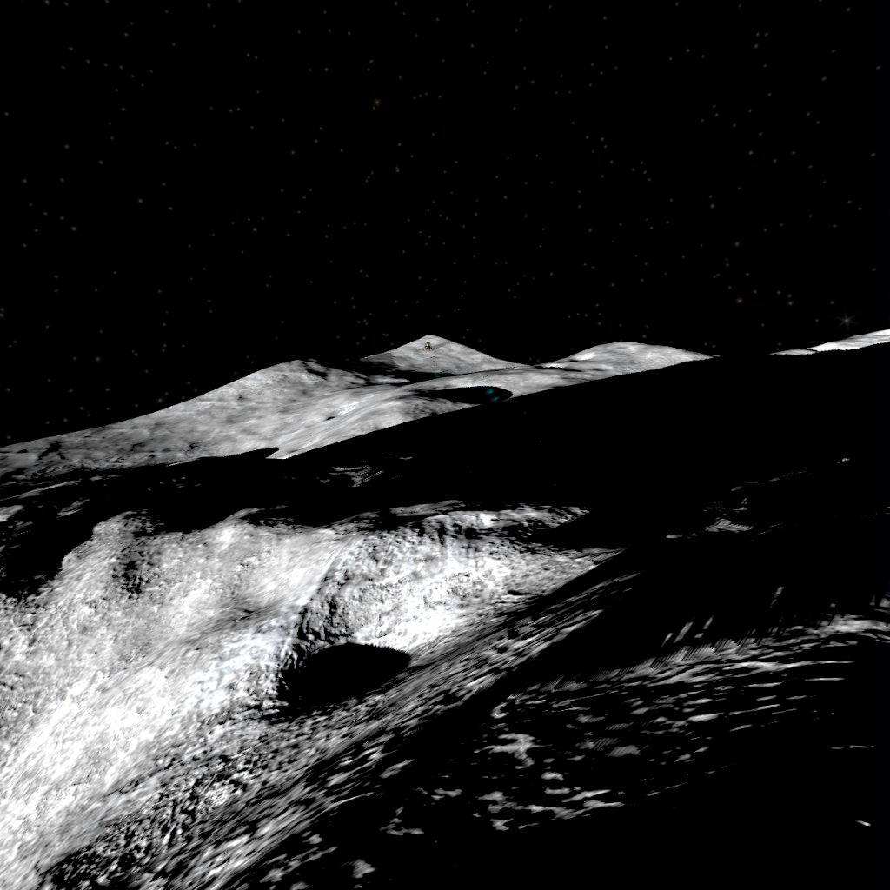
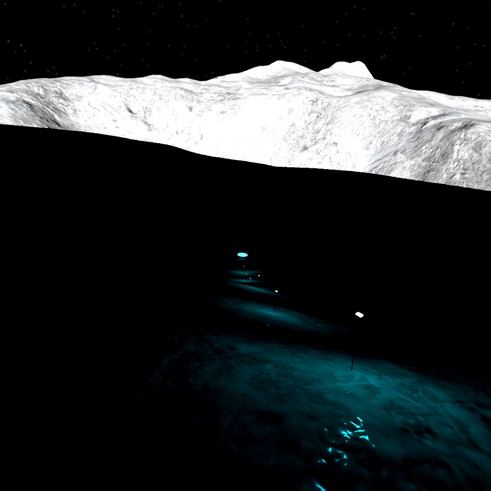
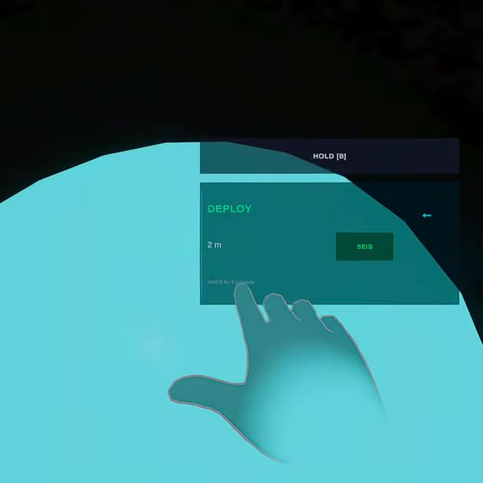
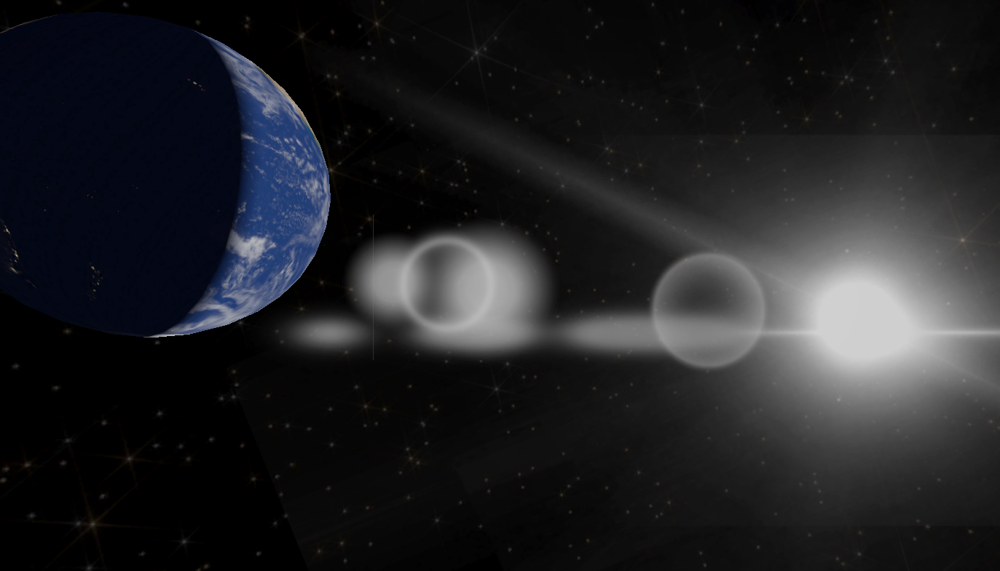
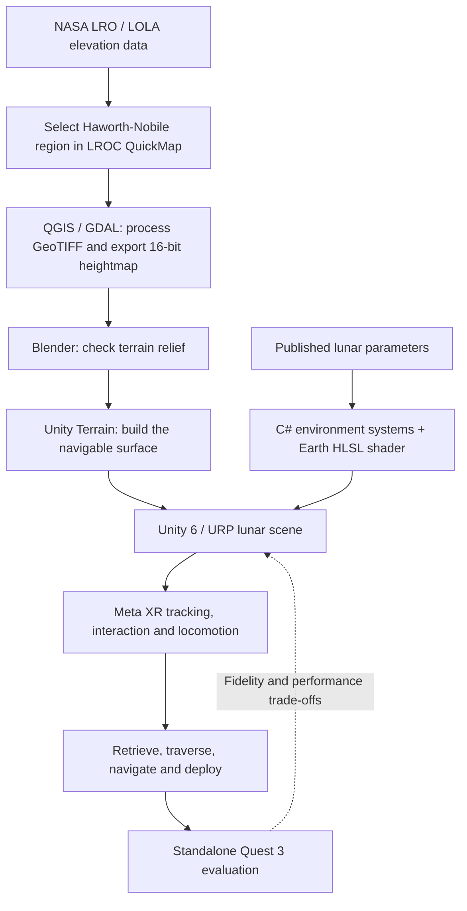
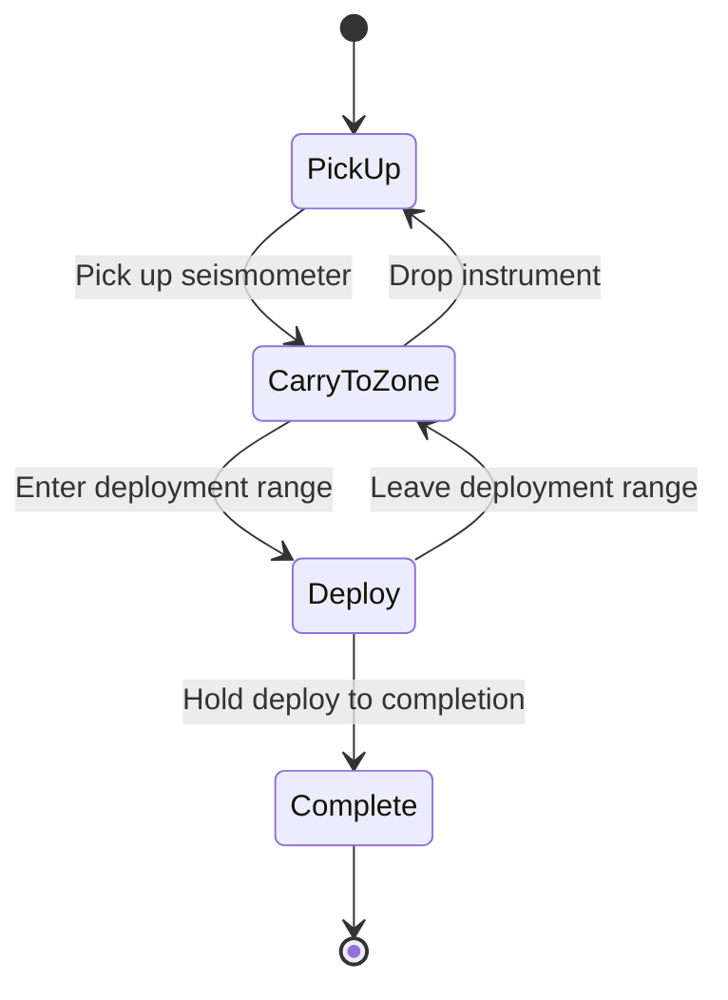

  
  
  
  
  

  <b>Kartik Gupta</b> · B.A.I. Computer Engineering · Trinity College Dublin 
  <a href="https://youtu.be/z2SDj-kG6RA">Watch the walkthrough</a> ·
  <a href="#the-mission">The mission</a> ·
  <a href="#the-research">The research</a> ·
  <a href="#how-it-works">How it works</a> ·
  <a href="#explore-the-source">Explore the source</a>

<table align="center">
  <tr>
    <td align="center"><h3>1.625 m/s²</h3>lunar gravity</td>
    <td align="center"><h3>1.5°</h3>sun above the horizon</td>
    <td align="center"><h3>1 km²</h3>of real NASA terrain</td>
    <td align="center"><h3>~900 m</h3>EVA traverse</td>
    <td align="center"><h3>~71 FPS</h3>on a standalone Quest 3</td>
  </tr>
</table>

## What is this?

Picture stepping off a lunar lander, grabbing a science instrument, and carrying it across terrain you've never seen, into shadow, with the Earth hanging just above the horizon. That's what this project turns into a standalone VR experience.

I rebuilt a small patch of the lunar south pole from NASA elevation data, swapped Unity's Earth-like defaults for documented lunar parameters, and gave the player a full instrument-deployment mission to carry out.

The question driving it wasn't just *can the Moon look convincing in VR?* It was **how much of a scientifically grounded lunar environment can a consumer headset actually handle, and where does fidelity have to give way to practical limits?**

   
  A few seconds from the walkthrough: following the lamp chain through shadow.

| At a glance | |
| :--- | :--- |
| **Experience** | Single-player lunar EVA (extravehicular activity) mission |
| **Where** | Haworth-Nobile region, lunar south pole |
| **Terrain** | 1,024 m × 1,024 m patch built from LOLA elevation data |
| **Runs on** | Meta Quest 3, as a standalone Android app |
| **Built with** | Unity 6, URP, C#, HLSL, Meta XR SDK |
| **Context** | B.A.I. Computer Engineering final-year project, April 2026 |

> [!TIP]
> **You don't need to download anything.** The [video walkthrough](https://youtu.be/z2SDj-kG6RA), the images here and the research summary below are the best way in. This repo keeps the full Unity project and its history, but it isn't packaged as a one-click release.

## The mission

It's inspired by lunar seismic science and the Artemis Lunar Environment Monitoring Station (LEMS) objective: a simplified interactive scenario rather than a copy of any approved mission procedure. Four steps, roughly a **900 m traverse** end to end:

<table>
  <tr>
    <td width="25%" align="center"></td>
    <td width="25%" align="center"></td>
    <td width="25%" align="center"></td>
    <td width="25%" align="center"></td>
  </tr>
  <tr>
    <td valign="top"><b>1 · Retrieve</b> Open the lander's equipment bay and pick up the seismometer.</td>
    <td valign="top"><b>2 · Traverse</b> Carry it toward the science zone, with terrain-following movement in lunar gravity.</td>
    <td valign="top"><b>3 · Navigate</b> Switch on a chain of lamps laid along the terrain and follow the visor HUD through the shadows.</td>
    <td valign="top"><b>4 · Deploy</b> Reach the target zone and hold to deploy.</td>
  </tr>
</table>

Along the way, doors, proximity highlights, a navigation arrow, a deployment indicator and a quick-action menu keep things readable, so the environment rendering is tied to an actual task instead of an empty scene.

All captures are original, unretouched project images from April 2026 (the Retrieve and Deploy frames are taken from the walkthrough video). They show that version of the simulation, not every later change in this repo.

## The research

**VR Simulation of the Lunar South Pole: A Physically Parameterised Environment** 
Kartik Gupta · Trinity College Dublin · April 2026 · Supervisor: **Mads Haahr**

The full dissertation is on my LinkedIn, under the **B.A.I. Computer Engineering entry in the Education section**. I've kept the PDF out of this repo on purpose.

It builds on the direction of Nilsson et al.'s CHI 2023 study, *Using Virtual Reality to Shape Humanity's Return to the Moon: Key Takeaways from a Design Study*. Rather than porting their system, I built a new Unity implementation aimed at consumer standalone hardware. Tommy Nilsson also gave early guidance on the project scope, and provided the Apollo lander and Orion interior models.

### Grounded in data

Every key design parameter in the dissertation traces back to a published source:

| Parameter | What the simulation uses |
| :--- | :--- |
| Surface gravity | 1.625 m/s² |
| Sun angle | Low-angle light at 1.5° solar elevation |
| Terrain relief | NASA LRO / LOLA elevation data, 5 m/pixel source product |
| Terrain in Unity | 1,025 × 1,025 heightmap over a 1,024 m square |
| Sun and Earth size in the sky | 0.53° and 1.9° apparent size (dissertation targets) |
| Lighting | Hard direct shadows, zero ambient light |

   
  The Earth seen from the lunar surface, day/night terminator and all. Dissertation Figure 4.6.

### What the evaluation found

The evaluation combines a **fidelity-versus-feasibility analysis**, a comparison with prior work, and on-device performance measurements. On a standalone Quest 3 build, Table 5.2 of the dissertation reports about **71 FPS against a 72 Hz target, with 96% GPU utilisation**.

So it works on the headset, but with very little GPU headroom to spare.

> [!NOTE]
> **Being upfront about the limits.**
> - The parameters above are the **dissertation's design targets**, not a claim that every visual effect or later scene revision is an exact physical model. The solar cycle is deliberately sped up, Earth libration is approximated, and the starfield is a visual backdrop rather than an ephemeris-driven sky. Movement, interaction ranges and mission pacing also bend a little for usability.
> - The performance numbers are **historical measurements of the evaluated build**, not a guarantee for the current branch or every viewing direction.
> - A planned miniPXI user study couldn't run within the university's ethics-approval timeline, so this project **doesn't claim** validated training effectiveness, measured learning gains, or user-study evidence of presence.
> - It's an independent academic prototype, **not a NASA or ESA training product**. The Eagle is a historical Apollo asset used in an Artemis-inspired scenario, not a model of the planned Artemis lander.

## How it works

### From lunar data to a playable environment

The terrain pipeline and the physical parameters set up the world. Custom runtime systems then tie the Sun, Earth, player, instrument, navigation and HUD together into one mission.

### The mission state machine

These states and transitions come straight from [`MissionManager.cs`](Assets/Scripts/MissionManager.cs).

## Explore the source

The main scene is [`Assets/LunarVR.unity`](Assets/LunarVR.unity), and the code that makes it tick lives in [`Assets/Scripts/`](Assets/Scripts/).

<strong>Where each system lives</strong>

 

| System | Implementation |
| :--- | :--- |
| Mission state and instrument handling | [`MissionManager.cs`](Assets/Scripts/MissionManager.cs) |
| Surface movement, lunar gravity and crouching | [`LunarLocomotion.cs`](Assets/Scripts/LunarLocomotion.cs) |
| Solar cycle and sky synchronisation | [`LunarSunRotation.cs`](Assets/Scripts/LunarSunRotation.cs) |
| Earth motion and illumination | [`EarthBehaviour.cs`](Assets/Scripts/EarthBehaviour.cs), [`EarthDayNight.shader`](Assets/Earth/EarthDayNight.shader) |
| Lamp-chain navigation | [`LampChainNavigator.cs`](Assets/Scripts/LampChainNavigator.cs) |
| Visor UI and objective guidance | [`HelmetHUD.cs`](Assets/Scripts/HelmetHUD.cs), [`NavigationArrow.cs`](Assets/Scripts/NavigationArrow.cs) |
| Equipment-bay interaction | [`DoorController.cs`](Assets/Scripts/DoorController.cs), [`DoorHandleInteractable.cs`](Assets/Scripts/DoorHandleInteractable.cs) |
| Repeatable scene and rendering setup | [`Assets/Scripts/Editor/`](Assets/Scripts/Editor/) |

The checked-in editor version is **Unity 6000.3.8f1**; package versions are in [`Packages/manifest.json`](Packages/manifest.json) and [`Packages/packages-lock.json`](Packages/packages-lock.json).

<strong>Repo storage, Git LFS, and building it yourself</strong>

 

This repo is both a showcase and my personal development archive. The big Unity assets are kept so the work can be revisited, not because anyone's expected to download and build it.

[`.gitattributes`](.gitattributes) sends large asset types (textures, models, audio, Unity `.asset` files) through **Git Large File Storage (LFS)**. Git itself only stores small pointer files, and the actual binaries live separately in LFS, so a checkout without them isn't a complete Unity project. More in [GitHub's Git LFS docs](https://docs.github.com/en/repositories/working-with-files/managing-large-files/about-git-large-file-storage). The small images under `docs/media/` are deliberately kept in regular Git, so this README doesn't need any LFS downloads.

If you do want to open it locally: use the recorded Unity version, pull the LFS objects, and let Package Manager resolve the dependencies. Testing on a device also needs Android build support, the relevant Meta/OpenXR setup and an authorised headset connection. I can't promise a clean-machine build from this README alone.

There's also an embedded URP package with local stereo-flare changes; its [patch notes](Packages/com.unity.render-pipelines.universal/LUNARVR-PATCH.md) explain why it's kept. Rendering and headset tweaks made after the dissertation aren't the configuration evaluated in the report, and flare alignment and occlusion still need device-specific testing.

Appendix B of the dissertation mentions an earlier repository URL and shader location. **This repo is the current project archive**, and the links above match its actual layout.

## What's next

The prototype is deliberately small: one terrain region, one player, one EVA. Terrain texturing is simplified, light bouncing off neighbouring terrain isn't modelled, celestial motion is approximate, and spacesuit biomechanics are out of scope. The Orion interior was explored during development but isn't part of the finished surface mission.

The dissertation points to where it could go from here: **a proper user evaluation, better terrain shading, ephemeris-driven sky motion, astronaut embodiment, a lunar rover, and bigger multi-scene environments.**

## Thanks and references

- **Mads Haahr**, my project supervisor at Trinity College Dublin.
- **Tommy Nilsson**, for early scoping guidance and for the Apollo lander and Orion interior models, as acknowledged in the dissertation.
- **Nilsson et al., CHI 2023:** [Using Virtual Reality to Shape Humanity's Return to the Moon](https://doi.org/10.1145/3544548.3580718), the main prior-work reference.
- **NASA LRO / LOLA and LROC QuickMap:** the terrain data everything is built on. The full acquisition and processing method is in dissertation Sections 3.2 and 4.1.
- **NASA Scientific Visualization Studio:** [Earth and Sun from the Moon's South Pole](https://svs.gsfc.nasa.gov/4944/), a celestial-geometry reference used in the research.

Third-party models, textures, audio and packages keep their own terms; having them in this archive doesn't grant permission to reuse or redistribute them. Where each README image came from is recorded in [`docs/media/README.md`](docs/media/README.md).

---

<b>Best place to start:</b> <a href="https://youtu.be/z2SDj-kG6RA">watch the lunar EVA walkthrough</a> ▶

