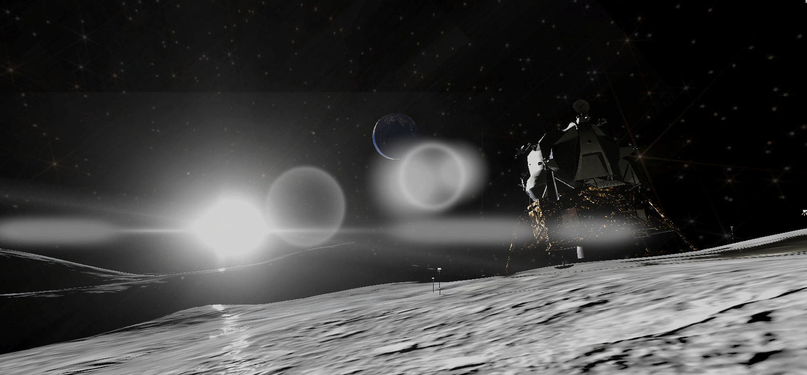
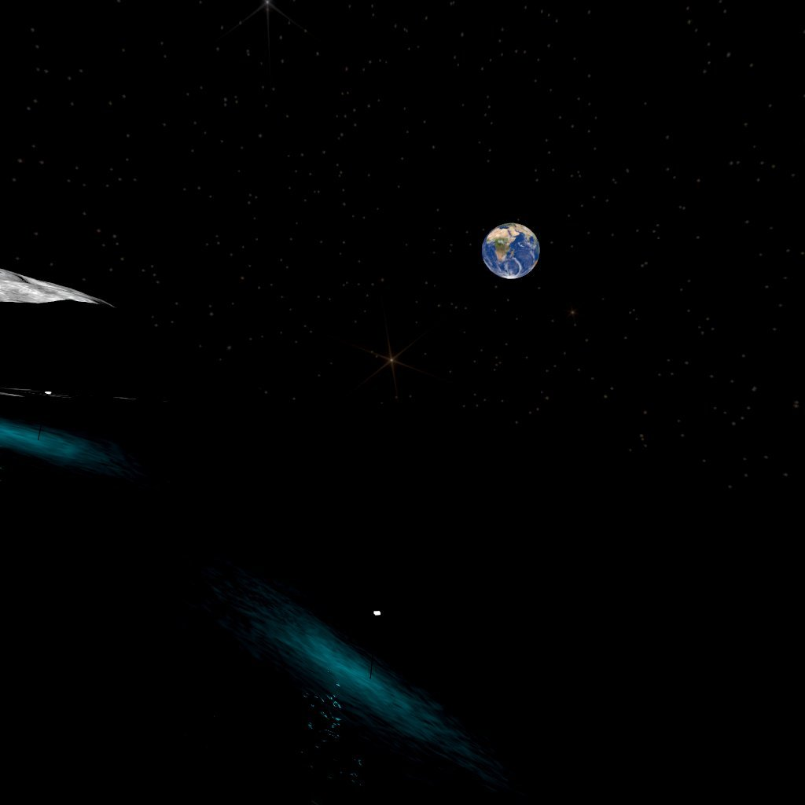
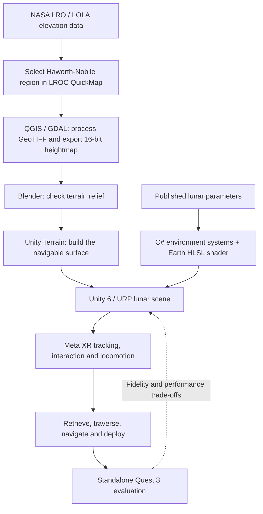
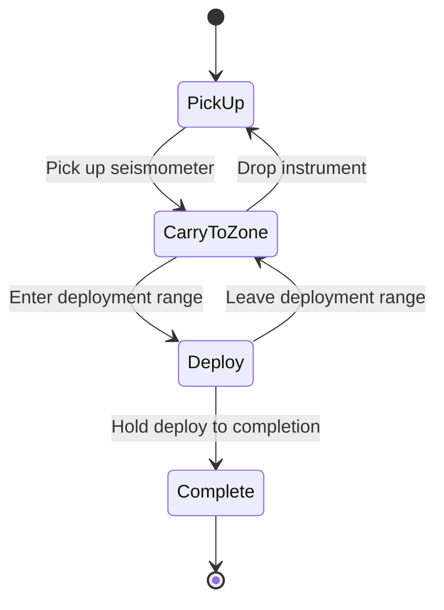

# VR Lunar South Pole

### From orbital elevation data to a standalone lunar EVA.

A physically parameterised VR environment for **Meta Quest 3**, built in **Unity 6**.

**Kartik Gupta** · B.A.I. Computer Engineering · Trinity College Dublin

[Watch the walkthrough](https://youtu.be/z2SDj-kG6RA) · [The research](#the-research) · [How it works](#how-it-works) · [Explore the source](#explore-the-source)

<em>A view from the simulation, reproduced from the dissertation. Click the image to watch the walkthrough on YouTube.</em>

## The Project

What would it feel like to leave a lunar lander, carry a scientific instrument across unfamiliar terrain, and navigate into shadow with the Earth hanging above the horizon?

This final-year engineering project turns that scenario into a standalone VR experience. It reconstructs a small region near the lunar south pole using NASA elevation data, replaces Earth-like environmental defaults with documented lunar parameters, and gives the player a complete instrument-deployment mission.

The central question is not just whether the Moon can look convincing in VR. It is **how much of a scientifically grounded lunar environment can be delivered on consumer standalone hardware, and where fidelity has to give way to practical constraints**.

| At a glance | |
| :--- | :--- |
| Experience | Single-player lunar extravehicular activity (EVA) mission |
| Environment | Haworth-Nobile region, lunar south pole |
| Terrain | 1,024 m x 1,024 m patch derived from LOLA elevation data |
| Target platform | Meta Quest 3, standalone Android application |
| Technology | Unity 6, URP, C#, HLSL, Meta XR SDK |
| Academic context | B.A.I. Computer Engineering final-year project, April 2026 |

**No download is needed to explore the project.** The [video walkthrough](https://youtu.be/z2SDj-kG6RA), images, and research summary are the intended starting points. This repository preserves the Unity project and its development history; it is not packaged as a one-click public release.

## The EVA Experience

The mission is inspired by lunar seismic science and the Artemis Lunar Environment Monitoring Station (LEMS) objective. It is a simplified interactive scenario, not a reproduction of an approved mission procedure.

1. **Retrieve the instrument.** Interact with the lander's equipment bay and pick up the seismometer.
2. **Traverse the surface.** Carry it toward the science zone, with terrain-following locomotion and lunar-gravity movement.
3. **Navigate the shadows.** Toggle a terrain-aligned chain of lamps and use the visor HUD to follow the objective.
4. **Deploy the seismometer.** Reach the target zone and complete the hold-to-deploy interaction.

The dissertation describes an approximately **900 m traverse**, connecting environmental rendering to an actual task rather than an empty scene. Doors, proximity highlights, a navigation arrow, a deployment indicator, and a quick-action menu support the experience.

<table>
  <tr>
    <td width="57%"></td>
    <td width="43%"></td>
  </tr>
  <tr>
    <td><strong>A connected sky.</strong> The Earth shader uses the same sun direction as the environment's lighting.</td>
    <td><strong>Navigation becomes part of the task.</strong> The lamp chain makes a route through shadow legible.</td>
  </tr>
</table>

Images are project captures from the dissertation, Figures 4.6 and 4.15. They document that version of the simulation, not every later change in this repository.

## The Research

**VR Simulation of the Lunar South Pole: A Physically Parameterised Environment**  
Kartik Gupta · Trinity College Dublin · April 2026  
Supervisor: **Mads Haahr**

The full dissertation is available under the **B.A.I. Computer Engineering entry in the Education section of my LinkedIn profile**. The PDF is intentionally not duplicated in this repository.

The project builds on the research direction of Nilsson et al.'s CHI 2023 study, *Using Virtual Reality to Shape Humanity's Return to the Moon: Key Takeaways from a Design Study*. Rather than porting that system, I built a new Unity implementation for consumer standalone hardware. Tommy Nilsson also provided early guidance on the project scope and the Apollo lander and Orion interior models.

### Grounded in data, explicit about approximations

The dissertation traces the environment's design parameters to published scientific sources:

| Input or design parameter | Research basis |
| :--- | :--- |
| Surface gravity | 1.625 m/s² |
| Low-angle solar illumination | 1.5° solar elevation |
| Terrain relief | NASA LRO / LOLA elevation data, 5 m/pixel source product |
| Terrain representation | 1,025 x 1,025 Unity heightmap over a 1,024 m square patch |
| Sun and Earth apparent size | Dissertation targets of 0.53° and 1.9°, respectively |
| Lighting approach | Hard direct shadows and zero ambient-light setting |

These are the **dissertation's design parameters**, not a claim that every visual effect or later scene revision is an exact physical model. The solar cycle is deliberately accelerated, Earth libration is approximated, and the starfield is a visual background rather than an ephemeris-driven sky. Motion, interaction ranges, and mission pacing also make usability concessions.

### What the evaluation found

The evaluation combines a **fidelity-versus-feasibility analysis**, comparison with prior work, and on-device performance observations. Table 5.2 of the dissertation reports approximately **71 FPS at a 72 Hz target**, with **96% GPU utilisation**, on a standalone Quest 3 build.

Those results show feasibility for the evaluated build, but also limited GPU headroom. They are historical measurements, **not a performance guarantee for the current branch or every viewing direction**.

A planned miniPXI user study was not conducted within the university ethics-approval timeline. The project therefore does **not** claim validated training effectiveness, measured learning gains, or user-study evidence of presence. It is an independent academic prototype, not a NASA or ESA training product.

## How It Works

### From lunar data to an interactive environment

The terrain pipeline and physical parameters establish the environment. Custom runtime systems connect the Sun, Earth, player, instruments, navigation, and HUD into a single mission.

### The mission state machine

These state names and transitions come directly from [`MissionManager.cs`](Assets/Scripts/MissionManager.cs).

## Explore the Source

| System | Implementation |
| :--- | :--- |
| Mission state and instrument handling | [`MissionManager.cs`](Assets/Scripts/MissionManager.cs) |
| Surface movement, lunar gravity and crouching | [`LunarLocomotion.cs`](Assets/Scripts/LunarLocomotion.cs) |
| Solar cycle and sky synchronisation | [`LunarSunRotation.cs`](Assets/Scripts/LunarSunRotation.cs) |
| Earth motion and illumination | [`EarthBehaviour.cs`](Assets/Scripts/EarthBehaviour.cs), [`EarthDayNight.shader`](Assets/Earth/EarthDayNight.shader) |
| Lamp-chain navigation | [`LampChainNavigator.cs`](Assets/Scripts/LampChainNavigator.cs) |
| Visor UI and objective guidance | [`HelmetHUD.cs`](Assets/Scripts/HelmetHUD.cs), [`NavigationArrow.cs`](Assets/Scripts/NavigationArrow.cs) |
| Equipment-bay interaction | [`DoorController.cs`](Assets/Scripts/DoorController.cs), [`DoorHandleInteractable.cs`](Assets/Scripts/DoorHandleInteractable.cs) |
| Repeatable scene and rendering setup | [`Assets/Scripts/Editor/`](Assets/Scripts/Editor/) |

The main scene is [`Assets/LunarVR.unity`](Assets/LunarVR.unity). The checked-in editor version is **Unity 6000.3.8f1**; package versions are recorded in [`Packages/manifest.json`](Packages/manifest.json) and [`Packages/packages-lock.json`](Packages/packages-lock.json).

<strong>Repository storage, Git LFS, and reproduction notes</strong>

This is both a project showcase and a personal development archive. The large Unity assets are retained so the work can be revisited, not because visitors are expected to download and build it.

The [`.gitattributes`](.gitattributes) file tracks large asset types through **Git Large File Storage (LFS)**, including textures, models, audio, and Unity `.asset` files. Git stores small pointer files; the corresponding binary content is stored separately through LFS. A checkout without those objects is not a complete Unity project. See [GitHub's Git LFS documentation](https://docs.github.com/en/repositories/working-with-files/managing-large-files/about-git-large-file-storage).

The small screenshots under `docs/media/` are intentionally stored in regular Git so the README does not require readers to fetch the project's LFS assets.

If you do choose to inspect the project locally, use the recorded Unity version, retrieve the LFS objects, and allow Package Manager to resolve the dependencies. Android build support, the relevant Meta/OpenXR setup, and an authorised headset connection are additional requirements for device testing. A clean-machine build is not guaranteed by this README.

The repository also includes an embedded URP package with local stereo-flare changes. Its [patch notes](Packages/com.unity.render-pipelines.universal/LUNARVR-PATCH.md) explain why it is retained. Rendering and headset-specific refinements made after the dissertation should not be confused with the configuration evaluated in the report; flare alignment and occlusion remain areas of device-specific testing.

Appendix B of the dissertation names an earlier repository URL and shader location. **This repository is the current project archive**, and the source links above reflect its actual layout.

## Scope and Next Steps

The prototype is deliberately bounded: one terrain region, one player, and one EVA mission. Terrain texturing is simplified, secondary illumination from neighbouring terrain is not modelled, celestial motion is approximate, and spacesuit biomechanics are outside the scope. The Eagle is a historical Apollo asset used in an Artemis-inspired scenario, not a model of the planned Artemis landing vehicle.

The dissertation identifies formal user evaluation, improved terrain shading, ephemeris-driven celestial motion, astronaut embodiment, a lunar rover, and expanded multi-scene environments as future directions. The Orion interior was explored during development but is not part of the completed surface mission.

## References and Acknowledgements

- **Mads Haahr**, project supervisor, Trinity College Dublin.
- **Tommy Nilsson**, for early scoping guidance and provision of the Apollo lander and Orion interior models, as acknowledged in the dissertation.
- **Nilsson et al., CHI 2023:** [Using Virtual Reality to Shape Humanity's Return to the Moon](https://doi.org/10.1145/3544548.3580718), the principal prior-work reference.
- **NASA LRO / LOLA and LROC QuickMap:** the terrain-data foundation; the full acquisition and processing method is documented in dissertation Sections 3.2 and 4.1.
- **NASA Scientific Visualization Studio:** [Earth and Sun from the Moon's South Pole](https://svs.gsfc.nasa.gov/4944/), a celestial-geometry reference used in the research.

Third-party models, textures, audio, and packages retain their respective terms. Their inclusion in this archive does not grant blanket permission to redistribute or reuse them. Screenshot provenance is recorded in [`docs/media/README.md`](docs/media/README.md).

---

**Start with the experience:** [Watch the lunar EVA walkthrough](https://youtu.be/z2SDj-kG6RA).
